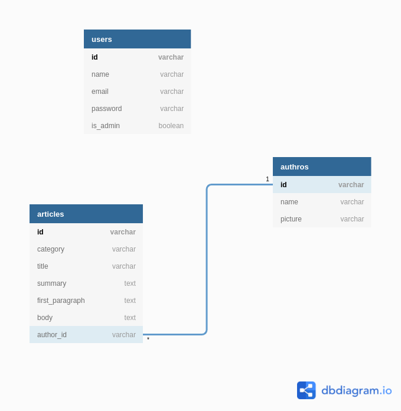

<div align="center">
    <h1>API REST</h1>
</div>

## Docs

See the diagram database



See the Insomnia collection

[](https://insomnia.rest/run/?label=Articles%20Api&uri=https%3A%2F%2Fgithub.com%2Fdeusimardamiao%2Farticles-api%2Fblob%2Fmaster%2Fdocs%2Finsomnia-collection.json)

## Development environment

Firstly, clone this repository:
```terminal
deusimar@deusimar $ git clone
```

### Install dependencies
```terminal
deusimar@deusimar $ yarn install
```

### Configuration

Copy the basic `.env.example` to new file `.env` and write your preferences of connections database.

```terminal
deusimar@deusimar $ cp .env.example .env
```

### Run migrations
```terminal
deusimar@deusimar $ yarn dev:migrate:latest
```

### Start dev server
```terminal
deusimar@deusimar $ yarn dev
```

## Production build
Run the following commands, same sequence:

Up containers
```terminal
deusimar@deusimar $ docker-compose up --build -d
```

Create extension on database to add uuid autogenerate. Replace the variable with our database connections settings.
```terminal
deusimar@deusimar $ docker exec -it postgres_db_api psql "host=YOUR_DATABASE_HOST port=YOUR_DATABASE_PORT dbname=YOUR_DATABASE_NAME user=YOUR_DATABASE_USER password=YOUR_DATABASE_PASSWORD" -c 'CREATE EXTENSION IF NOT EXISTS "uuid-ossp";'
```

Running migrations on productions build.
```terminal
deusimar@deusimar $ docker-compose run api /bin/sh -c "yarn migrate:latest"
```

## How to commit
After done your changes, run the following commands to commit:

```terminal
deusimar@deusimar $ git add .
```

With your changes in staged area, run:

```terminal
deusimar@deusimar $ git commit
```

The `husky` will run customized hooks of git to check the lint of the your changes. The `commitlint` will verify if your commit message respect the commit lint guide.
